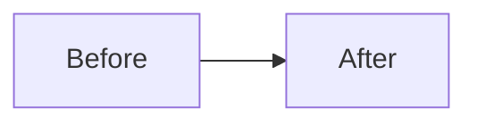

# Exit Skill Reference

## Manifest skeleton

```markdown
# Session Manifest: [SCOPE]
**Date:** YYYY-MM-DD HH:mm
**Agent:** [Claude Code / Cursor / Antigravity]
**Repos touched:** [list]

## Commits
| Repo | Branch | Hash | Message |
|------|--------|------|---------|
| damieus-com-migration | main | abc1234 | fix: ... |

## Dirty files (intentional WIP)
- `path/to/file` — reason not committed

## Next steps
1. ...
2. ...

## Background follow-up prompt
```
Fix only listed items; read-only verify after; do not expand scope; follow 40x and repo AGENTS.md.

Manifest: <path>
Gaps:
- [ ] ...
```
```

## Checkpoint for partner reporting

```markdown
# Checkpoint: [Title] — YYYY-MM-DD HHmm

## For Jay
[Plain-language summary of business value. No jargon. Short sentences.]

## Diagram

Diagram link: https://mermaid.live/edit#...

## Related links
- PR: https://github.com/DaBigHomie/repo/pull/NNN
- Issue: https://github.com/DaBigHomie/repo/issues/NNN

## Technical details
[For the engineering team — implementation notes, migrations, deploys.]
```
