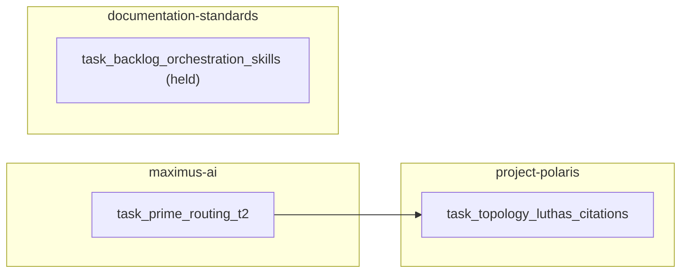

# plan-by-surface-repo-layer-signal

Read-only categorizer + sequencer for a queued backlog. Turns an unordered
list of items into a **surface / repo / layer / signal** categorization table
and a **DAG-sequenced set of plan documents** (one master + N per-owning-repo)
that a downstream orchestrator can dispatch as parallel or sequential waves.

**Hub:** `documentation-standards/skills/plan-by-surface-repo-layer-signal/SKILL.md`
**Related:** `plan-audit-fix` (execution recipe embedded in each emitted plan),
`forecast-scrutiny` (blast radius per item), `forensic-auditing` (verify-then-write
discipline), `doc-forensic-inventory` (drift check on plan doc landing sites),
`multi-model-task-assignment` (downstream wave dispatch), `warden` (doc-place
on the emitted plan docs).

## Path resolution (portable)

```bash
: "${MGMT_ROOT:?export MGMT_ROOT to workspace sibling-clones root}"
```

| Resource | Resolve order |
|----------|---------------|
| **This skill (Tier 1)** | `$MGMT_ROOT/documentation-standards/skills/plan-by-surface-repo-layer-signal/SKILL.md` |
| **plan-audit-fix (embedded recipe)** | `$MGMT_ROOT/documentation-standards/skills/plan-audit-fix/SKILL.md` |
| **forecast-scrutiny** | `$MGMT_ROOT/documentation-standards/skills/forecast-scrutiny/SKILL.md` |
| **forensic-auditing** | `$HOME/.claude/skills/forensic-auditing/SKILL.md` (global user skill; per-repo mirror at `.claude/skills/forensic-auditing/SKILL.md`) |
| **doc-forensic-inventory** | `$MGMT_ROOT/documentation-standards/skills/doc-forensic-inventory/SKILL.md` |
| **MALFIG gate** | `$MGMT_ROOT/documentation-standards/skills/malfig/SKILL.md` |
| **WARDEN doc-place** | `$MGMT_ROOT/documentation-standards/scripts/warden-doc-place.mts` |
| **validate-plan-completeness (G11)** | `$MGMT_ROOT/maximus-ai/scripts/validate-plan-completeness.mts` |
| **Authority plan (§7.1 / §7.4 / §1B basis)** | `${CURSOR_PLANS_DIR:-$HOME/.cursor/plans}/malfig_workflow_diff_map_ba19fb65.plan.md` |
| **PAC** | `$MGMT_ROOT/maximus-ai/docs/prime-governance/PRIME-PLACEMENT-ASSIGNMENT-CHARTER.md` |

> [!WARNING]
> **Verify-on-resolve (forensic-auditing Rule 4 — manifests != reality).** Run a
> deterministic `test -f` on any Path-resolution row before relying on it — hub
> landing state varies by checkout branch and machine (a stale working tree on a
> non-`master` branch reads as "absent" when the file is in fact on
> `origin/master`; check the ref, not one worktree). Known gaps as of 2026-07-14:
> - **Authority plan** (`malfig_workflow_diff_map_ba19fb65.plan.md`) — resolves
>   at NO `$CURSOR_PLANS_DIR` in this workspace. The §Fail-closed precheck below
>   governs: emit `UNKNOWN` rather than guessing from the inlined taxonomy.
> - **This skill (Tier 1)** — lands on `documentation-standards` master via
>   docstd PR #116; confirm it is present (`git cat-file -e origin/master:…`)
>   before treating the hub path as live SSOT.

## Scope boundaries (hard rails)

| Do | Do NOT |
|----|--------|
| Categorize each item into `{surface, repo, layer, signal}` | Author handoffs, solution docs, or problem records — held per user directive |
| Emit master plan + per-repo sub-plans | Execute the plans (downstream orchestrator dispatches waves) |
| Verify each §7.1 / §7.4 / §1B claim against the authority plan | Invent a categorization when the item is ambiguous — mark **UNKNOWN** and file a follow-up |
| Use portable `$MGMT_ROOT` in every path | Hardcode absolute paths |
| Cite CORTEX task IDs when input items come from CORTEX | Duplicate CORTEX row bodies inside the plan doc (index only) |

---

## Inputs

> [!WARNING]
> The `mcp__claude_ai_Supabase__execute_sql` connector is DISABLED whenever
> `ANTHROPIC_API_KEY` is set (the Claude Code default) — in that mode
> `ToolSearch("select:mcp__claude_ai_Supabase__execute_sql")` returns no match.
> Do not assume the connector is present; resolve access per the CORTEX
> access policy below before reading CORTEX-tracked tasks.

The skill accepts a queued backlog in any of three forms:

1. **CORTEX-tracked tasks** — list of `task_*` IDs; the skill loads their
   description, priority, status, and `blocked_on` via the CORTEX access
   policy (see "## CORTEX writes" below for the full resolve order):
   primary `mcp__claude_ai_Supabase__execute_sql` (`project_id:
   eccpracfbrocmkzuogec`) when claude.ai connectors are enabled; else
   CREDS-DIRECT via `maximus-ai/scripts/lib/cortex-write.mts` reader
   helpers, or the hosted `plugin:supabase:supabase` MCP scoped with
   `?project_ref=eccpracfbrocmkzuogec`.
2. **Inline backlog** — a JSON array embedded in the dispatch prompt with
   `{id, priority, status, description, blocked_on?}` per row.
3. **Repo state signals** — non-CORTEX queued items observed from the workspace
   (post-merge retirement queue, pending sync-skills fan-out, held authoring
   tasks).

Each item MUST have at minimum an `id` + a `description` before it can be
categorized. Items missing an id are given a synthetic `queue_YYYYMMDD_NN` id
and a follow-up task is filed to canonize them in CORTEX.

---

## Categorize (verify-then-write)

> [!IMPORTANT]
> **Fail-closed precheck.** Before categorizing anything, check that the
> authority plan resolves at
> `${CURSOR_PLANS_DIR:-$HOME/.cursor/plans}/malfig_workflow_diff_map_ba19fb65.plan.md`
> (or the PAC file at
> `$MGMT_ROOT/maximus-ai/docs/prime-governance/PRIME-PLACEMENT-ASSIGNMENT-CHARTER.md`).
> It may not exist on a given machine. If it is absent, the skill MUST NOT
> invent categorizations by guessing from memory of §7.1 / §7.4 / §1B — it
> emits `surface = UNKNOWN`, `repo = UNKNOWN`, `layer = UNKNOWN` for every
> item and files a follow-up task to source the authority plan, instead of
> guessing. The inlined 20-surface-type and three-tier lists below are the
> fallback taxonomy for `surface` and `layer` only when the authority plan
> is unavailable — the PAC §7.4 owning-repo mapping for `repo` REQUIRES the
> authority plan or the PAC file to be present; there is no safe fallback
> for `repo`.

For every input item, populate this row:

| Field | Source | Verification |
|-------|--------|--------------|
| `surface` | Authority plan §7.1 (20 types) | The item's primary artifact class must map to exactly one of the 20 rows in the §7.1 taxonomy — else **UNKNOWN** |
| `repo` | PAC §7.4 (`{owning-repo}`) | The item's `doc_type` + subject determines the PAC-declared owning repo — verify against the repo list under §MALFIG-scoped repos in the authority plan |
| `layer` | Authority plan §1B (Tier 1 / 2 / 3) | Tier 1 = canonical SSOT write; Tier 2 = generated/portable copy; Tier 3 = context/index only |
| `signal` | Prompt-declared trigger | One of `pr_merged:<sha>`, `gate_pass:<gate>`, `dep_lands:<task_id>`, `human_signoff:<role>`, `cron:<schedule>`, or `manual` |

### The 20 Prime surface types (from authority plan §7.1)

`Skill`, `Agent`, `Instruction`, `Command`, `Rule`, `Prompt`, `Script`, `Hook`,
`Plugin`, `MCP`, `CI workflow`, `Registry/boot`, `Workflow`, `Loop`,
`Orchestrator`, `Governance`, `Template`, `CORTEX rules`, `Sync mechanism`,
`Marketplace`.

### The three tiers (from authority plan §1B)

- **Tier 1** — canonical SSOT (write here). Single canonical hash; version in
  header + `component.manifest.json`; agent spec required.
- **Tier 2** — generated / portable copies. Hash MUST match Tier 1; carries
  `# GENERATED — edit canonical` banner.
- **Tier 3** — context / index only. Cite/link Tier 1; no new law.

### PAC placement (from authority plan §7.4)

| doc_type | Owning repo | Path |
|----------|-------------|------|
| plan (Prime) | repo that owns the work | `{repo}/docs-prime/plans/{SCOPED-NAME}.md` |
| plan (app-scoped) | repo that owns the work | `{repo}/docs/plans/{SCOPED-NAME}.md` |
| session-artifact | repo that ran the session | `{repo}/docs-prime/session-artifacts/{YYYY-MM-DD}_{slug}/` or `{repo}/docs/session-artifacts/` |
| specification / charter (Prime, cross-repo) | CANON hub | `documentation-standards/docs-prime/governance/` |
| governance / registry | maximus-ai | `maximus-ai/docs-prime/governance/` |

---

## Sequence (DAG + rationale)

1. **Compute in-degree per item** from `blocked_on` + implicit
   `dep_lands:<task_id>` signals.
2. **Group by owning repo.** Items owned by the same repo cluster into that
   repo's sub-plan.
3. **Sort within each repo** by (priority ASC → in-degree ASC → id ASC).
4. **Waves.** Items with no blockers form Wave 1 (parallelizable within a repo).
   Items unblocked by Wave 1 completions form Wave 2. Repeat.
5. **Cross-repo edges** stay in the master DAG. Per-repo sub-plans reference
   the master DAG for out-of-repo dependencies.
6. **Cycles** are illegal — if detected, break the cycle by dropping the lower-
   priority edge and file a follow-up task noting the removed edge.

---

## Emit (master + per-repo sub-plans)

> [!WARNING]
> **Blast radius.** Executing this skill writes plan docs into multiple
> repos, potentially including `atl-table-booking-app`. Every target-repo
> write MUST land on a FRESH WORKTREE cut from that repo's `origin/main` or
> `origin/master` — never a shared/existing checkout — and MUST NOT land in
> `atl-table-booking-app`'s active P0 release branches. **Dry-run / preview
> default:** before writing anything, the skill resolves and previews the
> full write set (every plan doc path + its target repo) for confirmation;
> writes proceed only after that preview is confirmed.

### Master plan

Location: `maximus-ai/docs/plans/QUEUED-BACKLOG-MASTER-PLAN-{YYYYMMDD}.md`
(rationale: maximus-ai owns cross-repo governance registry per PAC §7.4 row
"governance / registry"; use `docs/plans/` for app-scoped, `docs-prime/plans/`
for Prime-scoped — the skill picks per doc_type of the backlog cluster).

Required sections:

1. **Frontmatter** — `doc_type: plan`, `repo`, `owning_component`, `version`,
   `updated`, `status`, `related_tasks: [task_id, ...]`.
2. **Overview** — what backlog, when captured, why now.
3. **Categorization table** — one row per item: `{id, priority, status,
   surface, repo, layer, signal, notes}`.
4. **DAG (mermaid)** — nodes are item ids; edges are blocker relationships;
   cluster subgraphs by owning repo.
5. **Wave sequencing** — Wave 1 / Wave 2 / … per repo.
6. **Per-repo sub-plan pointers** — links to each emitted sub-plan.
7. **Execution recipe (embedded)** — see §Same-workflow-logic below.
8. **Non-goals** — planning only; execution handled by downstream dispatch.
9. **Change Log** — one row per plan version bump.

### Per-owning-repo sub-plans

Location: `{repo}/docs/plans/QUEUED-BACKLOG-{REPO-NAME}-PLAN-{YYYYMMDD}.md`
(or `docs-prime/plans/` when the cluster is Prime-scoped).

Same section shape as master, minus per-repo pointers (replaced by "parent
plan" pointer to master), plus a **Repo-local DAG** subview.

Skip empties: if a repo has zero items in this backlog, no sub-plan is
emitted for it.

### Governed doc-place

Before commit, run WARDEN on the target repo's `docs/` tree:

```bash
: "${MGMT_ROOT:?export MGMT_ROOT}"
npx tsx "$MGMT_ROOT/documentation-standards/scripts/warden-doc-place.mts" docs/ --json
```

Zero blockers required.

---

## Same-workflow-logic (embedded in every emitted plan doc)

Every plan doc emitted by this skill carries the same "how to execute this
plan" section verbatim, so the downstream orchestrator dispatch is uniform:

```markdown
## Execution recipe (per item in this plan)

Each item in this plan is delivered via the following governed pipeline:

1. **plan-audit-fix** — Phase 1 PLAN (fetch origin/main, PAC scan, blast radius),
   Phase 2 audit-fix-plan (fix the target artifact inline).
   Skill: `documentation-standards/skills/plan-audit-fix/SKILL.md`.
2. **Four-gate stack** (bounded fix loop, 1 iteration each):
   - `forecast-scrutiny` — blast radius + reversal-cost check.
   - `MALFIG` gate — G3 (no-op detection), G6 (path guard), G8 (CORTEX/task
     hygiene), G11 (plan completeness via `validate-plan-completeness.mts`),
     G13 (separation of duties).
   - `forensic-auditing` — Rule 1 (verify-then-write), Rule 4 (session-artifact
     hygiene), Rule 5 (Tier 3 duplicate-law scan).
   - `doc-forensic-inventory` — downstream link + manifest drift.
3. **Merge** — squash-merge on all-4-PASS with human authorization already
   recorded upstream; do NOT self-approve inside the executing agent (G13).

Human authorization for merge-on-all-gates-PASS is inherited from the master
plan frontmatter `merge_authorization` field.
```

---

## CORTEX writes (index only, never body)

When the skill runs against a live backlog:

1. **Emit task per plan doc:** `task_plan_by_surface_{repo}_{YYYYMMDD}` with
   `output_blob.plan_path` = the emitted plan doc path.
2. **Back-link each queued item:** update each input CORTEX task's
   `output_blob.parent_plan` = the per-repo sub-plan path (or master plan path
   for cross-repo items).
3. **Never mirror the plan body** into CORTEX — index row only.

### CORTEX access policy (portable, resolve in order)

1. **Primary — claude.ai connectors enabled:**
   `ToolSearch("select:mcp__claude_ai_Supabase__execute_sql")`, then call
   with `project_id: "eccpracfbrocmkzuogec"`.
2. **Fallback — MCP unavailable** (e.g. `ANTHROPIC_API_KEY` is set, or
   running under Claude Code): CREDS-DIRECT via
   `maximus-ai/scripts/lib/cortex-write.mts` helpers (`cortexWriteTask`,
   `cortexWriteKnowledge`), which read `SUPABASE_URL` +
   `SUPABASE_SERVICE_ROLE_KEY` from `maximus-ai/.env.local` and are gated by
   `CORTEX_CLOUD_SYNC`.
3. **Alternate fallback:** the hosted `plugin:supabase:supabase` MCP scoped
   with `?project_ref=eccpracfbrocmkzuogec`.

### UPSERT contract (no raw INSERT)

- Task rows UPSERT `on_conflict=(id)`.
- Knowledge rows UPSERT `on_conflict=(key)`.
- Route ALL writes through `cortex-write.mts` — it performs a read-back
  verify and a delete-guard.
- Raw `INSERT` is FORBIDDEN — it duplicates rows on re-run.

### Project-scope rail

- All CORTEX writes target project `eccpracfbrocmkzuogec` ONLY.
- The skill MUST NEVER write the ATB project `vodxijszxtxasaovjahp` — that
  project belongs to `atl-table-booking-app` and is out of scope for this
  skill under any code path.

---

## Tier-2 distribution

> [!IMPORTANT]
> Tier-2 mirror copies of this skill (under `.cursor/`, `.gemini/`, `.claude/skills/...`)
> MUST carry a `# GENERATED — edit canonical` banner and MUST be regenerated
> from this Tier-1 canonical — never hand-edited. Any mirror found without
> that banner is a known distribution defect: file a follow-up task to
> regenerate it from this file rather than editing the mirror directly.

---

## Non-goals

- Do NOT author handoffs, solution docs, or problem records (held per user
  directive; separate skills own those surfaces).
- Do NOT execute the plans (the downstream orchestrator / wave dispatcher
  owns execution).
- Do NOT self-approve merges (G13 separation-of-duties).
- Do NOT modify shared worktrees or non-owned branches.
- Do NOT invent categorizations — verify-then-write, UNKNOWN + follow-up when
  uncertain.

---

## Anti-patterns

| Do not | Do instead |
|--------|------------|
| Hardcode `/Users/.../Management Git/...` | `$MGMT_ROOT/...` |
| Categorize an item without matching it against §7.1's 20 rows | Mark surface = **UNKNOWN**, file a follow-up |
| Duplicate CORTEX task descriptions in plan body | Reference by id; body stays in CORTEX |
| Emit a hub `documentation-standards/docs/plans/` doc for an app-scoped item | Emit to `{owning-repo}/docs/plans/` per PAC §7.4 |
| Skip WARDEN doc-place on emitted plans | Run `warden-doc-place.mts` pre-commit |
| Break a DAG cycle silently | Drop lower-priority edge + file follow-up noting removal |

---

## Example — categorizing a small sample backlog

Given this inline backlog:

```json
[
  {"id": "task_prime_routing_t2_blocking_gate_20260707",
   "priority": "P1", "status": "pending",
   "description": "Flip validate-topology.mts from report-only to blocking as MALFIG G14"},
  {"id": "task_topology_luthas_citations_mechanism_20260707",
   "priority": "P2", "status": "pending",
   "description": "Design + implement bundle-citations handoff mechanism polaris → dame-luthas-app"},
  {"id": "task_backlog_orchestration_skills_20260707",
   "priority": "P3", "status": "pending",
   "description": "8 candidate orchestration skills — do NOT author now"}
]
```

The skill emits:

**Categorization table:**

| id | priority | surface | repo | layer | signal |
|----|----------|---------|------|-------|--------|
| task_prime_routing_t2_blocking_gate_20260707 | P1 | Script | maximus-ai | Tier 1 | `human_signoff:dispatcher` |
| task_topology_luthas_citations_mechanism_20260707 | P2 | Sync mechanism | project-polaris | Tier 1 | `dep_lands:task_prime_routing_t2_blocking_gate_20260707` |
| task_backlog_orchestration_skills_20260707 | P3 | Skill (x8) | documentation-standards | Tier 1 | `manual` — held |

**Master DAG (mermaid):**



**Emitted plans:**

- Master: `maximus-ai/docs/plans/QUEUED-BACKLOG-MASTER-PLAN-20260707.md`
- Sub: `maximus-ai/docs/plans/QUEUED-BACKLOG-MAXIMUS-AI-PLAN-20260707.md`
- Sub: `project-polaris/docs/plans/QUEUED-BACKLOG-POLARIS-PLAN-20260707.md`
- Sub: `documentation-standards/docs/plans/QUEUED-BACKLOG-DOCSTD-PLAN-20260707.md`

Each sub-plan embeds the §Same-workflow-logic execution recipe verbatim.

---

## Governance references

- Authority plan (surface taxonomy + tier model): `${CURSOR_PLANS_DIR:-$HOME/.cursor/plans}/malfig_workflow_diff_map_ba19fb65.plan.md` §7.1 / §7.4 / §1B
- PAC placement: `maximus-ai/docs/prime-governance/PRIME-PLACEMENT-ASSIGNMENT-CHARTER.md`
- Doc types: `documentation-standards/docs/DOC-TYPE-RUBRIC.md`
- Plan completeness (G11): `maximus-ai/scripts/validate-plan-completeness.mts`
- Separation of duties (G13): `.claude/skills/human-approval-gate/SKILL.md` (repo-distributed skill; present in each enrolled repo's `.claude/skills/` — no global `$HOME/.claude/skills/` copy)

---

## Change Log

| Version | Date | Author | Change |
|---------|------|--------|--------|
| 1.0.0 | 2026-07-07 | plan-by-surface authoring dispatch | Initial skill — categorize backlog by surface/repo/layer/signal + emit master + per-repo plan docs with embedded execution recipe |
| 1.1.0 | 2026-07-14 | audit-fix-plan (prime-orchestration-adapt) | Portable CORTEX access (creds-direct fallback) + authority-plan fail-closed precheck + fresh-worktree/dry-run guard + UPSERT on_conflict contract + project-scope rail (no ATB project) + portable authority path + Tier-2 regeneration note |
| 1.1.1 | 2026-07-14 | audit-fix-plan (Tier-1 backport) | Fixed two residual path defects verified on disk — forensic-auditing (`$MGMT_ROOT/plugins/...` -> `$HOME/.claude/skills/`) and human-approval-gate (`$HOME/.claude/skills/...` -> repo-local `.claude/skills/`); added verify-on-resolve WARNING for hub-unlanded rows (Tier-1 skill, DOC-TYPE-RUBRIC) + absent authority plan. Backport from career-corpus PR #48 (task_pbss_backport_tier1_canonical). |
