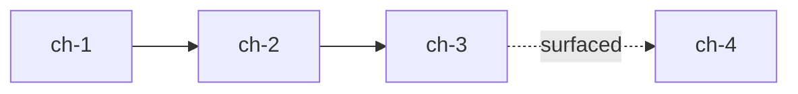

<!-- GENERATED FROM maximus-ai/skills/session-chapter-index/SKILL.md -- do not edit; run sync-skills.mts -->

# session-chapter-index

Read-only 50x forensic pass over an active or just-finished session that emits
**markers** — not documents — to seed downstream handoff, solution-doc, and
problem-record authoring. Chapters describe the narrative arc; threads describe
the parallel workstreams; cross-refs describe where they intersected; pointers
identify which existing solution/architecture docs a downstream skill should
touch; the handoff seed captures the minimum structural payload for the next
authoring step.

**Hub:** `documentation-standards/skills/session-chapter-index/SKILL.md`
**Related:** `forensic-auditing` (methodology), `plan-audit-fix` (upstream),
`doc-forensic-inventory` (downstream doc sweep), `session-cleanup-checkpoint`
(session teardown pair), `session-status` (read-only status pair),
`ide-store-forensic-index` (retrospective peer — see §Differentiation),
`handoff-framework` (consumes the seed).

## Path resolution (portable)

```bash
: "${MGMT_ROOT:?export MGMT_ROOT to workspace sibling-clones root}"
```

| Resource | Resolve order |
|----------|---------------|
| **This skill (Tier 1)** | `$MGMT_ROOT/documentation-standards/skills/session-chapter-index/SKILL.md` |
| **forensic-auditing (methodology)** | `$MGMT_ROOT/plugins/forensic-auditing/skills/forensic-auditing/SKILL.md` |
| **forecast-scrutiny** | `$MGMT_ROOT/documentation-standards/skills/forecast-scrutiny/SKILL.md` |
| **plan-audit-fix (upstream)** | `$MGMT_ROOT/documentation-standards/skills/plan-audit-fix/SKILL.md` |
| **doc-forensic-inventory (peer)** | `$MGMT_ROOT/documentation-standards/skills/doc-forensic-inventory/SKILL.md` |
| **session-status (peer)** | `$MGMT_ROOT/documentation-standards/skills/session-status/SKILL.md` |
| **session-cleanup-checkpoint (peer)** | `~/.claude/skills/session-cleanup-checkpoint/SKILL.md` |
| **handoff-framework** | `$MGMT_ROOT/handoff-framework/HANDOFF_PROTOCOL.md` |
| **ide-store-forensic-index (retro peer)** | `~/.claude/skills/ide-store-forensic-index/SKILL.md` |

## Differentiation — `session-chapter-index` vs `ide-store-forensic-index`

| Skill | Scope | Direction | Sources | Output |
|-------|-------|-----------|---------|--------|
| `ide-store-forensic-index` | HISTORICAL cross-store hunt (`~/.cursor`, `~/.claude`, `~/.gemini`) | Retrospective | Chat store archives, transcripts, tool-results, Downloads | Session registry + artifact registry across stores |
| `session-chapter-index` (this) | ACTIVE / just-finishing SINGLE session | Forward-seeding (feeds downstream authoring) | CORTEX `cortex_tasks`, merged PRs on `origin/main\|master`, session memory entries, `git worktree list`, docs authored in window | Structured markers: chapters, threads, cross-refs, solution-doc pointers, handoff seed |

They compose: `ide-store-forensic-index` locates prior sessions; if one is
selected, `session-chapter-index` then structures it into markers for
downstream authoring.

## Composition

- **Methodology.** Applies `forensic-auditing` Rules 0–5 as the analytical
  framework: evidence-before-assertion (Rule 0), name ≠ behavior (Rule 1),
  quantify drift vs `origin/main` (Rule 2), abstraction-aware tracing (Rule 3),
  disk over manifests (Rule 4), pipeline DAGs + locked-worktree respect
  (Rule 5), and non-destructive posture (Rule 6).
- **Upstream.** Typically invoked after `plan-audit-fix` and/or during a
  `session-cleanup-checkpoint` teardown, before any handoff or solution-doc
  authoring skill runs.
- **Downstream consumers.** The `handoff seed` block feeds `handoff-framework`
  authoring; the `solution-doc-update pointers` feed `doc-forensic-inventory`
  and eventual doc-edit skills.
- **Blast-radius pre-flight.** Composes with `forecast-scrutiny` — this skill
  is read-only, so the expected verdict is **SAFE**.

## Inputs

| Input | Form | Required |
|-------|------|----------|
| `session_id` | CORTEX `cortex_tasks.session_id` (e.g. `polaris-bootstrap-20260607`) | one of the three |
| `date_window` | ISO range (e.g. `2026-07-01..2026-07-07`) | one of the three |
| `current_session` | `.cortex-boot.json` `session_id` in cwd | one of the three |
| `primary_repo` | Repo slug (e.g. `documentation-standards`, `maximus-ai`, `project-polaris`) | recommended |
| `secondary_repos` | Additional repos touched during the session | optional |

Env vars (loaded via each repo's `.env.local` / `scripts/lib/env.mts` pattern):

- `SUPABASE_URL`
- `SUPABASE_SERVICE_ROLE_KEY` (for CORTEX reads)
- `GH_TOKEN` (only if `gh` is not already authed for merged-PR listing)
- `MGMT_ROOT` (workspace root for sibling-clone resolution)

## Method

Deterministic steps. Every step reads OBSERVABLE ARTIFACTS — never memory.

### Step 1 — Ground truth (Rule 0, Rule 2)

```bash
: "${MGMT_ROOT:?export MGMT_ROOT}"
cd "$MGMT_ROOT/${primary_repo}"
git fetch origin -q
git rev-parse --abbrev-ref HEAD
git log origin/main -1 --oneline 2>/dev/null || git log origin/master -1 --oneline
git worktree list
git status -sb
```

Record the SSOT SHA, dirty state, and every worktree (locked ones are
DO-NOT-TOUCH per Rule 5).

### Step 2 — CORTEX task set (Rule 4)

Query `cortex_tasks` for the session's rows and every child. Prefer
service-role via the Supabase MCP or a small tsx query. Fallback: raw REST.

```bash
# Example REST pattern (adapt to repo's env loader)
curl -sS -H "apikey: $SUPABASE_SERVICE_ROLE_KEY" \
     -H "Authorization: Bearer $SUPABASE_SERVICE_ROLE_KEY" \
     "$SUPABASE_URL/rest/v1/cortex_tasks?session_id=eq.${session_id}&select=id,title,status,created_at,updated_at,parent_id,metadata&order=created_at.asc"
```

Also pull tasks whose `parent_id` chains up to a session task, and any tasks
whose `metadata->>'session_id'` matches (some agents nest it there).

### Step 3 — Merged PRs on `origin/main|master` in window (Rule 2, Rule 4)

For each repo touched during the session:

```bash
# Prefer gh for merged PR metadata
gh pr list --repo "DaBigHomie/${primary_repo}" \
  --state merged --search "merged:${date_window}" \
  --json number,title,mergedAt,mergeCommit,headRefName,body \
  --limit 100

# Cross-check with git log — git wins over tracker
git log origin/main --since "${date_from}" --until "${date_to}" \
  --pretty='%h %ai %s' 2>/dev/null || \
  git log origin/master --since "${date_from}" --until "${date_to}" \
  --pretty='%h %ai %s'
```

Reconcile CORTEX task status against `git log`: a task marked pending whose
PR is on `origin/main|master` is a **desync** — flag it in the markers block
(per `forensic-auditing` Rule 4), do not silently mark complete.

### Step 4 — Memory entries authored in window (Rule 4)

```bash
find "$HOME/.claude/projects" -type f -name "*.md" \
  -newermt "${date_from}" ! -newermt "${date_to}" \
  -path "*/memory/*" 2>/dev/null
```

These become authoritative signals for chapter boundaries — a memory entry
usually marks a decision or lesson worth its own chapter beat.

### Step 5 — Docs/handoffs/plans authored in window (Rule 4)

```bash
# Per touched repo
find "$MGMT_ROOT/${primary_repo}/docs" -type f \
  \( -name "*.md" -o -name "*.mdx" \) \
  -newermt "${date_from}" ! -newermt "${date_to}" 2>/dev/null
```

Pay special attention to `docs/handoffs/`, `docs/plans/`, `docs/prompts/`,
`docs/session-artifacts/`, and any file matching the DOC-TYPE-RUBRIC
(`*-ARCHITECTURE.md`, `*-SOLUTION.md`, `*-SPEC.md`).

### Step 6 — Correlate → chapters (Rule 1)

A **chapter** is a natural narrative segment. Chapter boundaries are
identified deterministically, not by feel:

| Boundary signal | Evidence |
|-----------------|----------|
| Goal shift | New parent CORTEX task with distinct `title` root |
| Phase transition | Merged PR titled `feat/*` after a run of `docs/*` (or reverse) |
| Wave/sprint transition | New session sub-id in `cortex_tasks.metadata` |
| Discovery event | Memory entry authored between two PR bursts |
| Repo pivot | First commit against a new repo in the window |

Each chapter row: `id`, `start_artifact`, `end_artifact`, `one_line_summary`,
`key_decisions[]`.

### Step 7 — Correlate → threads (Rule 5)

A **thread** is a parallel workstream (e.g. `BG-V1 T1`, `BG-W Row 1`). Group
CORTEX tasks by `metadata->>'thread_id'`, `metadata->>'bg_dispatch'`, or
consistent title prefix; cross-check with `git worktree list` and PR
`headRefName` patterns.

Each thread row: `id`, `description`, `bg_agent_dispatches[]`,
`cortex_task_ids[]`, `pr_numbers[]`, `depends_on[]`.

### Step 8 — Cross-refs (Rule 1, Rule 3)

Any place a chapter surfaced a finding that another chapter/thread had to
resolve (e.g. "Chapter 3 docs relocation triggered by Chapter 4 authority
plan discovery"). Emit as `from → to (reason)` edges. These become the DAG
for the mermaid diagram.

### Step 9 — Solution-doc-update pointers (identify only)

For every merged PR in Step 3 with `doc_type: solution-architecture`,
`doc_type: spec`, or a `docs/*-ARCHITECTURE.md` / `-SOLUTION.md` / `-SPEC.md`
path touched:

- record `path` (repo-relative)
- record `section` (nearest H2/H3 above the diff)
- record `reason` (which chapter/thread motivated the touch)

**This skill DOES NOT edit those docs.** It emits a pointer list; a
downstream `doc-forensic-inventory` + `plan-audit-fix` pass performs the
edits under governance.

### Step 10 — Handoff seed (identify only)

Populate the minimum structural payload for a downstream handoff:

- `goal` (from the session's root CORTEX task title)
- `artifacts[]` (merged PRs + authored docs + memory entries)
- `unresolved[]` (CORTEX tasks still `pending` / `in_progress` / `blocked`)
- `next_agent_pointers[]` (thread ids + their owning agent per
  `multi-model-task-assignment` if available)

**This skill DOES NOT write the handoff document.** `handoff-framework`
consumes the seed.

## Output shape

Emit a single Markdown block with the sections below. JSON siblings may
follow if the caller passes `--json`, but the human-readable Markdown block
is the SSOT.

```markdown
## SESSION-CHAPTER-INDEX — <session_id_or_window>

### Meta
- session_id: <id or "date-window">
- date_window: <ISO..ISO>
- primary_repo: <slug>
- secondary_repos: [<slug>, ...]
- ssot_sha:
  - <repo>: <origin/main|master sha>
- generated_at: <ISO>
- generator: session-chapter-index v1.0.0

### Chapters
| # | id | start_artifact | end_artifact | one_line_summary | key_decisions |
|---|----|----------------|--------------|------------------|---------------|
| 1 | ch-1 | PR#12 (feat/x) | memory/orchestrate-dont-implement.md | Wave 0 kickoff; adopted BG-agent dispatch | ["delegate cheap agents"] |

### Threads
| id | description | bg_dispatches | cortex_task_ids | pr_numbers | depends_on |
|----|-------------|---------------|-----------------|------------|------------|
| th-BG-V1-T1 | Polaris resume validate | [BG-V1 T1] | [task_...] | [#8] | [] |

### Cross-refs
| from | to | reason |
|------|----|--------|
| ch-3 | ch-4 | docs relocation surfaced by authority-plan discovery |

### Solution-doc-update pointers (identify only — DO NOT rewrite here)
| repo | path | section | motivating chapter/thread |
|------|------|---------|---------------------------|
| maximus-ai | docs/WARDEN-ARCHITECTURE.md | ## Supabase domain | ch-2 |

### Handoff seed (identify only — DO NOT author here)
- goal: <one line from root CORTEX task>
- artifacts:
  - pr: DaBigHomie/<repo>#<n> (<title>) @ <mergedAt>
  - doc: <repo>/docs/<path> (authored <date>)
  - memory: ~/.claude/projects/.../<slug>.md
- unresolved:
  - <task_id>: <title> [<status>]
- next_agent_pointers:
  - th-BG-V1-T1 → agent <N> (per multi-model-task-assignment)

### Desyncs (Rule 4 — tracker vs git)
| cortex_status | git_evidence | note |
|---------------|--------------|------|
| pending | PR#8 merged @ 2026-07-06 | mark complete downstream |

### DAG (optional mermaid)


### Verdict (per forensic-auditing)
VERDICT: PROCEED | HOLD | QUARANTINE
DRIFT: <N> commits behind origin/main
DO-NOT-TOUCH: <locked worktrees / active sessions>
NEXT SAFE ACTION: hand markers to handoff-framework + doc-forensic-inventory
```

## Worked example (illustrative — invented for shape only)

Session `polaris-bootstrap-20260607`, window `2026-07-01..2026-07-07`,
primary_repo `project-polaris`.

- **Chapters:** ch-1 corpus seeding → ch-2 bundle selection tooling → ch-3
  docs relocation → ch-4 authority-plan discovery (surfaced ch-3's gap).
- **Threads:** th-corpus (agent 590), th-tailor (agent 592),
  th-validate (agent 594).
- **Cross-refs:** ch-4 → ch-3 (authority-plan discovery motivated relocation).
- **Solution-doc pointers:** `project-polaris/docs/PROJECT.md` §Submit
  Policy; `career-corpus/CLAUDE.md` §Pipeline.
- **Handoff seed:** goal = "wire corpus→bundle→resume pipeline";
  unresolved = `task_rico_london_platform_20260604`.
- **Desyncs:** none.
- **Verdict:** PROCEED, DRIFT: 0.

## What this skill does NOT do

| Non-goal | Belongs to |
|----------|------------|
| Author a handoff document | `handoff-framework` (consumes the seed) |
| Rewrite solution/architecture/spec docs | `doc-forensic-inventory` + `plan-audit-fix` |
| Create a problem record | `problem-record-creation` |
| Modify CORTEX rows beyond a self-index task | downstream orchestrator |
| Delete worktrees / branches / files | `session-cleanup-checkpoint` (plan only), git-hygiene (execution, gated) |
| Push, merge, or open PRs | `malfig-ship` |
| Distribute this skill to other IDE surfaces | `documentation-standards/scripts/sync-skills.mts` |
| Run any destructive git ops | Forbidden by Rule 6 |

## Hard guardrails

| Allowed | Forbidden |
|---------|-----------|
| `git fetch`, `git log`, `git show`, `git status`, `git worktree list` | `git checkout`, `git reset`, `git rm`, `git worktree remove`, force-push |
| Read CORTEX rows (service-role) | Write CORTEX rows other than the self-index task |
| Read files in any repo | Edit files in any repo |
| Emit the markers block to the chat / a temp file | Author or overwrite handoff / solution / spec / plan docs |

## Pairs with

- `forensic-auditing` — Rules 0–5 methodology (this skill's analytical spine).
- `plan-audit-fix` — typical upstream orchestrator.
- `doc-forensic-inventory` — downstream doc sweep that consumes solution-doc pointers.
- `session-cleanup-checkpoint` — session teardown pair; run this skill BEFORE checkpoint if a handoff is expected.
- `session-status` — read-only status snapshot (complementary; this skill adds narrative structure).
- `handoff-framework` — downstream consumer of the handoff seed.
- `ide-store-forensic-index` — retrospective peer (see §Differentiation).
- `forecast-scrutiny` — pre-flight blast-radius check (expected SAFE).
- `malfig` / `malfig-ship` — downstream if the produced markers motivate a PR.

## Anti-patterns

| Do not | Do instead |
|--------|------------|
| Summarize the session from memory | Query CORTEX + `git log` + memory files, cite each |
| Write the handoff doc in this skill | Emit the handoff seed; hand to `handoff-framework` |
| Edit solution/architecture docs here | Emit pointers; hand to `doc-forensic-inventory` |
| Trust CORTEX `status` blindly | Reconcile against `git log origin/main|master` — git wins (Rule 4) |
| Force-remove a locked worktree | Report as DO-NOT-TOUCH (Rule 5) |
| Hardcode `/Users/<who>/...` paths | Use `$MGMT_ROOT` and `$HOME` |

## Change Log

| Version | Date | Change |
|---------|------|--------|
| 1.0.0 | 2026-07-07 | Initial. 50x forensic session-marker generator; identifies chapters/threads/cross-refs/solution-doc-pointers/handoff-seed without authoring documents. |
