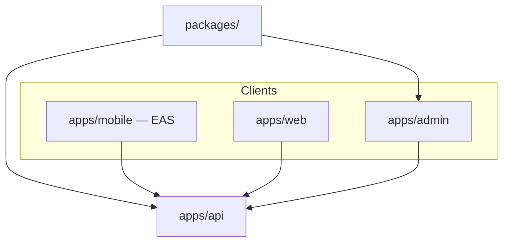

# Deploy architecture

| Monorepo path | Vercel project name | Deploy? |
|---------------|-------------------|---------|
| `apps/admin` | `<PROJECT_NAME>-admin` | Yes |
| `apps/web` | `<PROJECT_NAME>-web` | Yes |
| `apps/api` | `<PROJECT_NAME>-api` | Yes |
| `apps/mobile` | — | EAS only |
| `packages/<LIB>` | — | No |

**Notes:**
- Replace `<PROJECT_NAME>` and `<LIB>` with your actual monorepo structure.
- Vercel project names should map 1:1 to canonical IDs stored in `scripts/vercel-projects.ts`.
- The library package is shared but not independently deployed.
